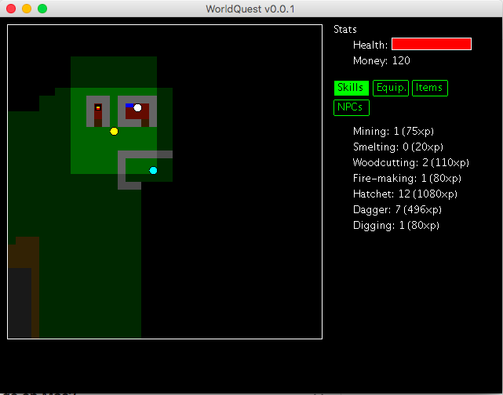

# WorldQuest

WorldQuest RPG is a single-player role-playing game set in a fantasy world.

## Features

### Game World

* 2 Maps
* Stairs
* Doors that open and shut
* 2 Enemy Types
* Shop that sells items
* Talking to NPCs

### Skills

* Woodcutting
* Fire-making
* Melee Combat
* Digging
* Mining
* Smelting
* Experience

### Items

* Armour
* Weapons

### Quests

* Ability to start quests
* Quest-state locked dialog
* Quest completion dialog
* Kill-X quest
* Multi-step quest support

## Roadmap

Goals for version 1.0 (Public Release)

* A decent-size game world with rivers, bridges, forests and dungeons
* Doors that require keys
* Fetch quests
* Quest rewards
* Quest requirements
* Fetch quests
* Persistent NPC death & health
* At least one multi-step quest
* FOV that respects walls.
* Selling items
* Hit splats
* Game messages when stuff happens
* AI with different combat strategies
* Smithing
* Crafting
* Ranged weapons
* Magecraft
* Prospecting

Goals for version 2.0

* Auto-generated, persistent dungeons
* Auto-generated, persistent surface landscape
* Deeper conversational AI
* Enemy respawn mechanics
