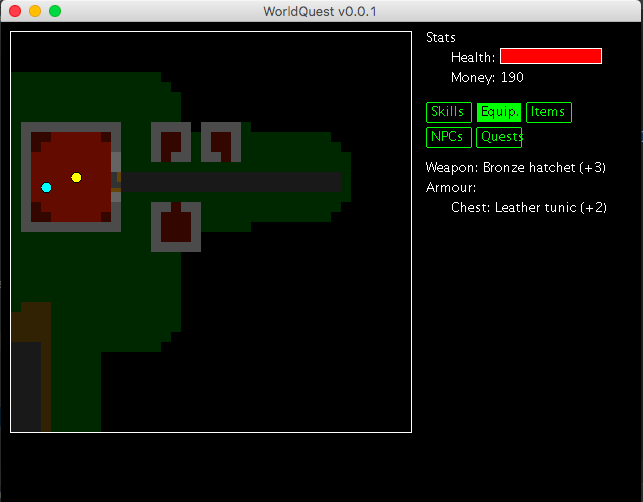

# WorldQuest

WorldQuest RPG is a single-player role-playing game set in a fantasy world.

## Features

### Game World

* 2 Maps
* Stairs
* Doors that open and shut
* 2 Enemy Types
* Shop that sells items
* Talking to NPCs
* Obstruct-able field of view

### Skills

* Woodcutting
* Fire-making
* Melee Combat
* Digging
* Mining
* Smelting
* Experience

### Items

* Armour
* Weapons

### Quests

* Ability to start quests
* Quest-state locked dialog
* Quest completion dialog
* Kill-X quest
* Multi-step quest support

## UX

* Tabbed interface for stats
* Map-click actions
* WASD controls
* Game messages for feedback

## Roadmap

Goals for version 1.0 (Public Release)

* Hunger, food, armour and healing
* Smithing
* A decent-size game world with rivers, bridges, forests and dungeons
* Doors that require keys
* Fetch quests
* Quest rewards
* Quest requirements
* Persistent NPC death & health
* At least one multi-step quest
* Selling items
* Hit splats
* AI with different combat strategies
* Crafting
* Ranged weapons
* Magecraft
* Prospecting
* Right-click actions
* Less text, more item graphics in UI

Goals for version 2.0

* Auto-generated, persistent dungeons
* Auto-generated, persistent surface landscape
* Deeper conversational AI
* Enemy respawn mechanics
